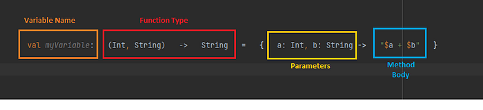

# funciones-kotlin
Kotlin dispone de múltiples formas de ejecutar bloques de código dentro del contexto de un objeto.

## Funciones de extensión
https://kotlinlang.org/docs/extensions.html

- Extienden la funcionalidad de una clase sin tocar su código.
- Las funciones de extensión permiten agregar nuevas funciones a clases existentes sin modificarlas ni heredar de ellas.
- Se definen anteponiendo el tipo al que extienden seguido de un punto antes del nombre de la función.

```kotlin
Integer.nuevafuncion() : String

fun String.firstAndLast(): String {
    return "${this.first()} - ${this.last()}"
}

fun main() {
    println("Kotlin".firstAndLast()) // Salida: K - n
}
```

## Funciones Scope
https://kotlinlang.org/docs/scope-functions.html

- En Kotlin, las funciones de scope son funciones que permiten trabajar con objetos, usando ese objeto cómo contexto. 
- Estas funciones permiten manipular un objeto dentro de un bloque sin tener que hacer referencia explícita al objeto en cada línea. Son muy útiles para mejorar la legibilidad y fluidez del código.

**¿Qué es el contexto de una variable?**
Es la zona del código donde esa variable es **válida y puede ser utilizada**. Define el alcance de la variable, es decir, el lugar en el programa donde su nombre es reconocido y puede ser accedido o modificado.

## Funciones Lambda
Una lambda es una función anónima (sin nombre) que puede asignarse a una variable o pasarse como parámetro.

- También conocidas cómo funciones anónimas
- Tienen una sintaxis compacta
- Funciones de lógica simple
- La variable almacena un objeto de función


```kotlin
val suma = { a: Int, b: Int -> a + b }
```

### Función tradicional
```kotlin
fun verificarNumero(numero: Int): String {
    return when {
        numero > 0 -> "Positivo"
        numero == 0 -> "Cero"
        else -> "Negativo"
    }
}
```

### Función Lambda
```kotlin
val verificarNumero: (Int) -> String = { numero ->
    when {
        numero > 0 -> "Positivo"
        numero == 0 -> "Cero"
        else -> "Negativo"
    }
}
```
### Estructura
Se escriben entre {}
Variable = Parámetros -> Cuerpo
Se llama cómo si la variable fuera una función



